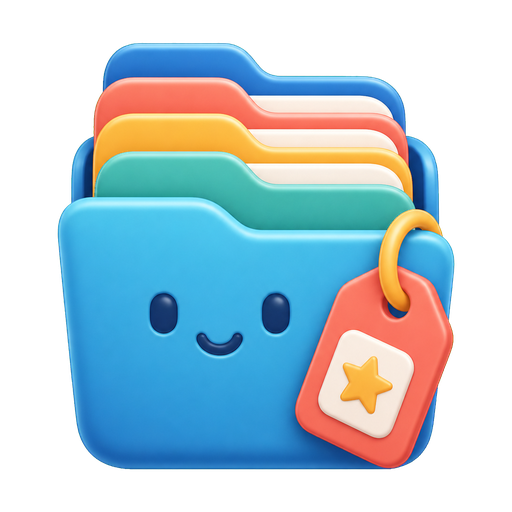

<p align="center">
  
</p>

# Categorax

Categorax is a friendly terminal-first tool for tagging and categorizing files and folders.

It was created because file tagging should not feel like a programmer-only feature. Many tools expose powerful command flags, tiny popups, or hidden metadata behavior, but Categorax is designed around a guided menu that ordinary people can follow: choose a number, read a clear hint, type the tag or category, and keep going.

## What Categorax Does

- Tags files and folders with simple words like `family`, `invoice`, `research`, or `urgent`.
- Adds one category to each item, such as `Work`, `Personal`, `Study`, or `Finance`.
- Shows nearby tag and category suggestions so users do not need to remember previous labels.
- Browses a folder tree grouped by tag or category.
- Works from the terminal on Windows, macOS, and Linux.
- Adds a Windows Explorer right-click menu so selected files and folders can be opened directly in Categorax.
- Keeps metadata in small `.categorax/tags.json` files beside your content, making it easy to copy, backup, inspect, and version.
- Ships with a backgroundless icon that is embedded into the Windows `.exe`, included in the macOS `.app`, and packaged for Linux desktop launchers.

## Why I Created This

Categorax was inspired by the idea behind InTag: make Windows files and folders easier to organize with tags. But the goal here is different:

- The interface should be understandable for non-programmers.
- The command line should feel guided, beautiful, and calm.
- The tool should make categories and tags easy to browse.
- The project should be portable, open, and simple to build.

Categorax is for students, teachers, families, office workers, researchers, creators, and anyone who has ever lost a file because folder names were not enough.

## Install

Download a release for your platform from GitHub Releases.

After downloading, place the executable somewhere stable, for example:

- Windows: `C:\Tools\Categorax\categorax.exe`
- macOS: move `Categorax.app` to `Applications`, or use the included `categorax` terminal binary.
- Linux: copy `categorax` to `/usr/local/bin/categorax`; optional desktop launcher assets are included under `share/`.

On macOS/Linux, make it executable if needed:

```sh
chmod +x categorax
```

## Windows Right-Click Menu

On Windows, run:

```powershell
categorax install-context
```

After that, right-click a file or folder and choose **Categorax**.

To remove the menu:

```powershell
categorax uninstall-context
```

The right-click integration is installed for the current user and does not require administrator access.

The Windows executable includes the Categorax icon, so users do not need to download any separate icon file.

If Windows Terminal is installed, Categorax uses it with a Categorax tab title. If Windows Terminal is not installed, Categorax falls back to the normal Windows console/CMD behavior. The executable itself still carries the Categorax icon.

## Guided Menu

Open Categorax with selected paths:

```sh
categorax menu --path "./Photos/Summer" --path "./Docs/report.pdf"
```

Or simply run:

```sh
categorax
```

The guided menu will show numbered choices:

```text
CATEGORAX
Friendly tags and categories for files and folders

What would you like to do?
  1. Add tags
  2. Remove tags
  3. Set category
  4. View current details
  5. Browse by tag/category
  6. Install Windows right-click menu
  7. Help
  8. Exit
  0. Back/Exit
```

Users can type numbers, choose suggestions, and add new tags by typing plain words.

## Command Examples

Add tags:

```sh
categorax add --tag vacation --tag family --path "./Photos/Summer"
```

Remove a tag:

```sh
categorax remove --tag draft --path "./Docs/report.docx"
```

Set a category:

```sh
categorax category Work --path "./Docs/report.docx"
```

View tags and categories:

```sh
categorax list --path "./Docs/report.docx"
```

Browse everything under a folder:

```sh
categorax browse --root "./"
```

## How Storage Works

Categorax stores metadata in a small JSON file:

```text
YourFolder/
  file-a.pdf
  file-b.jpg
  .categorax/
    tags.json
```

That file records tags and categories for items in the folder. This makes Categorax predictable across Windows, macOS, and Linux.

## Build From Source

Install Rust, then run:

```sh
cargo build --release
```

The production binary will be created at:

```text
target/release/categorax
```

On Windows:

```text
target/release/categorax.exe
```

## GitHub Release Builds

The included workflow builds release artifacts for:

- Windows
- macOS
- Linux

To create a release, push a version tag:

```sh
git tag v0.1.1
git push origin v0.1.1
```

You can also run the workflow manually from GitHub Actions.

## Current Notes

Categorax uses its own portable tag database instead of relying only on operating-system metadata. This makes the tool consistent and easy to understand. Future versions may optionally sync tags into Windows Explorer metadata where the platform supports it well.

## License

MIT
